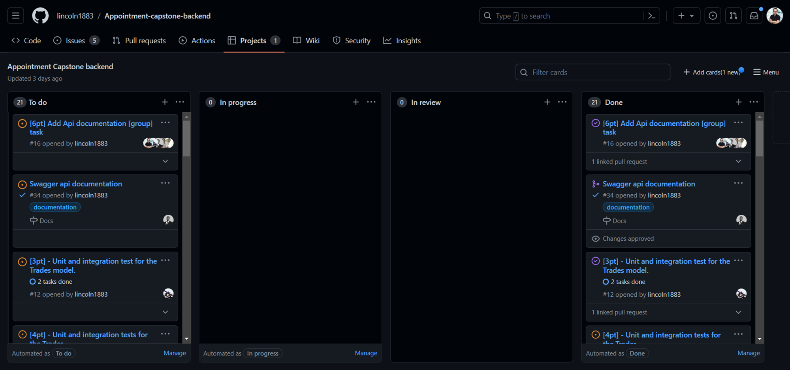

 

	<h1>HandyHome Hub App Back-end (API)</h1>
  

# 📗 Table of Contents
- [📖 About the Project](#about-project)
  - [🛠 Built With](#built-with)
    - [Tech Stack](#tech-stack)
    - [Key Features](#key-features)
- [💻 Getting Started](#getting-started)
- [👥 Authors](#authors)
- [📈 Kanban Board](#kanban)
- [🔭 Future Features](#future-features)
- [🤝 Contributing](#contributing)
- [⭐️ Show your support](#support)
- [🙏 Acknowledgements](#acknowledgements)
- [📝 License](#license)

# ⚙️ "HandyHome Hub" Backend  

**HandyHome Hub Back-End" is a Ruby on Rails application that serves as a RESTful API. It utilizes PostgreSQL as its database.
This API serves as the server-side component for booking appointments with home service providers, making it easy for users to schedule services such as house cleaning, plumbing, or any other home-related tasks.

## 🖥️Integration with Front-End

This back-end project is designed to seamlessly integrate with its counterpart *front-end project* 👉🏽[Appointment-capstone-frontend](https://github.com/lincoln1883/Appointment-capstone-frontend). The front-end, built with React.js and Redux, consumes the API provided by this back-end to provide a user-friendly interface for booking appointments.
## 🛠 Built With 

### Tech Stack 
### Built With 

#### Tech Stack 

- Ruby on Rails
- PostgreSQL

#### Key Features 

- User authentication: Users can log in to the website using their username.
- User authorization: Users can only access their own appointments.
- Viewing home services: Users can see a list of available home services with details.
- Appointment booking: Users can book appointments with service providers.
- Services management: Service providers ("admin" users) can create, edit, and delete services.

(<a href="#readme-top">back to top</a>)

<!-- GETTING STARTED -->

## 💻 Getting Started 

### Prerequisites

Ruby (version 3.2)
Ruby on Rails (version 7.0)
PostgreSQL (version 15)

### Setup

1. Clone the repository:

`git clone https://github.com/lincoln1883/Appointment-capstone-backend.git`

2. Install the dependencies:

`bundle install`

3. Set up the database

`rails db:create`
`rails db:migrate`
`rails db:seed`

4. Start the server in a bash terminal:

`rails s`

5. Open your web browser and navigate to: http://localhost:3001/ to check that the server is running properly.

6. Review the API documentation at: http://localhost:3001/api-docs/index.html

7. **Front End**: To install the front-end of this project, please visit the [Appointment-capstone-frontend](https://github.com/lincoln1883/Appointment-capstone-frontend) repository and follow the instructions in the README.md file.

(<a href="#readme-top">back to top</a>)

<!-- AUTHORS -->

## 👥 Authors (in alphabetical order)
>

👤 **Cosmos Hagan**
- GitHub: [cosmosha](https://github.com/Cosmosha)
- LinkedIn: [cosmoshagan](https://gh.linkedin.com/in/cosmoshagan)
- Twitter: [@hagancosmos](https://twitter.com/hagancosmos)

👤 **Ibrahim Hossain**
- GitHub: [ibugithub](https://github.com/ibugithub)
- LinkedIn: [ibuu](https://www.linkedin.com/in/ibuu/)
- Twitter: [@mdibrahimibuu](https://twitter.com/mdibrahimibuu)

👤 **Jorge Camargo**
- GitHub: [@jicamargo](https://github.com/jicamargo)
- LinkedIn: [Jorge Camargo](https://www.linkedin.com/in/jorgecamargog/?locale=en_US)
- Twitter: [@ji_camargo](https://twitter.com/ji_camargo)

👤 **Lincoln Gibson**
- GitHub: [lincoln1883](https://github.com/lincoln1883)
- LinkedIn: [lincoln-gibson](https://www.linkedin.com/in/lincoln-gibson)
- Twitter: [@lincolngibson7](https://twitter.com/lincolngibson7)

👤 **Moyasi Ginko**
- GitHub: [@MoyasiGinko](https://github.com/MoyasiGinko)
- LinkedIn: [moyasi](https://www.linkedin.com/in/moyasi/)
- Twitter: [@moyasi_ginko](https://twitter.com/moyasi_ginko)

(<a href="#readme-top">back to top</a>)

<!-- KANBAN BOARD -->

## 📈 Kanban Board

The project's kanban board is available [here](https://github.com/lincoln1883/appointment-capstone-backend/projects/1)

You can see a screenshoot of the initial state of the board below:

(<a href="#readme-top">back to top</a>)

## 🔭 Future Features 

- [ ] **Add categories to services**
- [ ] **Add payment processing**
- [ ] **Add user profiles**
- [ ] **Add user reviews and ratings**

(<a href="#readme-top">back to top</a>)

## 🤝 Contributing 

Contributions, issues, and feature requests are welcome!

Feel free to check the [issues page](https://github.com/lincoln1883/Appointment-capstone-backend/issues).

(<a href="#readme-top">back to top</a>)

## ⭐️ Show your support 

- If you like this project please give it a ⭐️!

(<a href="#readme-top">back to top</a>)

## 🙏 Acknowledgments 

- We would like to thank to [microverse](https://www.microverse.org/) For teaching me the database and more things.
- Thank to Murat Korkmaz on Behance for the design of the website 👉🏽.(https://www.behance.net/gallery/26425031/Vespa-Responsive-Redesign)
- Thanks a lot to everyone who will get time to check this out.

(<a href="#readme-top">back to top</a>)

## 📝 License 

This project is [MIT](./LICENSE) licensed.

(<a href="#readme-top">back to top</a>)

